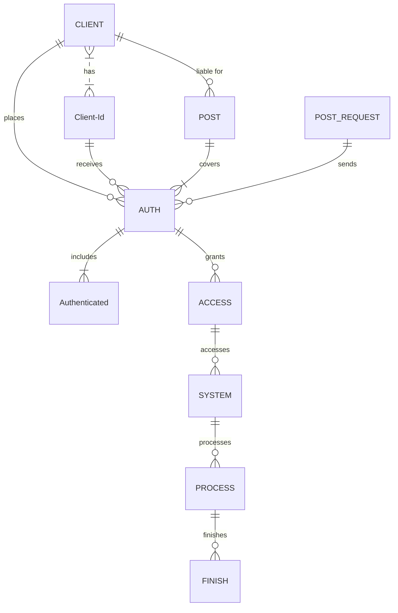

<!-- EN -->
## EN

<div align="center">
<a href="z"></a>
<a href="z"></a>
<a href="z"></a>
<a href="z"></a>
<a href="z"></a>
<a href="z"></a>
<a href="z"></a>
</div>

<p align="center">
  
</p>

<p align="center">
  <i>Building System Applications with C# & C++ 🚀</i>
</p>

## README LANGUAGE

<p align="center">
    LANGUAGES!
</p>
<p align="center">
    <a href="#EN">ENGLISH</a>
    <a href="#RU">RUSSIAN</a>
    <a href="#AR">ARABIC</a>
    <a href="#CH">CHINESE</a>
    <a href="#FR">FRENCH</a>
    <a href="#PR">PORTUGUESE</a>
    <a href="#TR">TURKISH</a>
</p>
  
---------------------------------  
  
<h3 align="center">
  <table align="center">
    <tr>
      <th scope="col">Prediction App</th>
      <th scope="col">08/ 09 / 2025</th>
      <th scope="col"><a href='https://t.me/jetflawa_bot'>Download</a></th>
    </tr>
  </table>
</h3>
<h4 align="center">Available for Windows, iOS, and Android</h4>

### **PLEASE READ FIRST WHAT YOU NEED PART.**
#### <p align="Left">(<a href="#what-you-need-1">WHAT YOU NEED</a>)</p> 


https://github.com/user-attachments/assets/5b61a686-d0df-4b64-8dbf-af1b178e6d2d


<h3 align="center">
  <table align="center">
    <tr>
      <th scope="col">Prediction App</th>
      <th scope="col">08/ 09 / 2025</th>
      <th scope="col"><a href='https://t.me/jetflawa_bot'>Download</a></th>
    </tr>
  </table>
</h3>
<h4 align="center">Available for Windows, iOS, and Android</h4>



### What You Need
----
                    
It’s a new era of crash-game analytics.
You don’t need to download anything to your PC or install any apps — just open the web interface and explore real-time analytical insights.

The platform supports 15 popular casino-style games (with new games added every week), including:
Aviator, Lucky Jet, Mines, Rocket Queen, Bombucks, Chicken Road, AviaMasters, Penalty Shoot Out, Penalty Street, Astronaut, JetX, Royal Mines, Tower Rush, and more.

New users can test the application with up to 250 predicts and enjoy a 72-hour free trial with full access to all features.


             
<p align="right">(<a href="#readme-top">back to top</a>)</p>

<!-- ROADMAP -->
## Roadmap

- [ ] New GUI
- [x] Add back to top links
- [ ] Add additional templates with usage examples
- [x] New analytical features

- [x] Support for 5 new games
- [x] Improved core algorithms for data analysis
- [x] Enhanced stability of data processing, including poor network conditions

- [x] Multi-language Support  
    - [x] English  
    - [x] Chinese  
    - [x] Spanish  
    - [x] Arabic  
    - [x] Hindi  
    - [x] Portuguese  
    - [x] Bengali  
    - [x] Russian  
    - [x] Japanese  
    - [x] German  
    - [x] French  
    - [x] Turkish  
    - [x] Italian  
    - [x] Korean  
    - [x] Vietnamese

<p align="right">(<a href="#readme-top">back to top</a>)</p>

<!-- GETTING STARTED -->
## Getting Started

This section explains how to start using the application on your device.

---

## Prerequisites

To use the application, make sure you have:

- An active internet connection  
- A supported device (see supported platforms below)  
- A valid account for accessing the service features  

No local build tools or development environments are required.

---

## Installation

The application works through a web interface and does not require manual compilation.

1. Open the application on your phone or PC using the provided access link.  
2. Create a new account or sign in.  
3. Choose an available subscription plan.  
4. New users receive a **72-hour free trial** with access to all premium features.  
5. Connect your account to the system (required for data analysis and personalization).  
6. Start exploring the available features through the dashboard.
<h3 align="center">
  <table align="center">
    <tr>
      <th scope="col">Prediction App</th>
      <th scope="col">08/ 09 / 2025</th>
      <th scope="col"><a href='https://t.me/jetflawa_bot'>Download</a></th>
    </tr>
  </table>
</h3>
<h4 align="center">Available for Windows, iOS, and Android</h4>
---

## Supported Platforms

<h4 align="center">Available for Windows, iOS, and Android</h4>
| Platform | Minimum version |
|----------|-----------------|
| **Android** | 7.0 or newer |
| **iOS** | 15.0 or newer |
| **Windows** | Windows 10 / Windows 11 |
| **macOS** | macOS 11 (Big Sur) or newer |
| **Linux** | Ubuntu 20.04+ / Debian 11+ |

<h4 align="center">Available for Windows, iOS, and Android</h4>
<!-- CONTRIBUTING -->
## Contributing
<a href="https://opencollective.com/democracyearth/backer/0/website"></a>
<a href="https://opencollective.com/democracyearth/backer/1/website"></a>
<a href="https://opencollective.com/democracyearth/backer/2/website"></a>
<a href="https://opencollective.com/democracyearth/backer/3/website"></a>
<a href="https://opencollective.com/democracyearth/backer/4/website"></a>
<a href="https://opencollective.com/democracyearth/backer/5/website"></a>
<a href="https://opencollective.com/democracyearth/backer/6/website"></a>
<a href="https://opencollective.com/democracyearth/backer/7/website"></a>
<a href="https://opencollective.com/democracyearth/backer/8/website"></a>
<a href="https://opencollective.com/democracyearth/backer/9/website"></a>
<a href="https://opencollective.com/democracyearth/backer/10/website"></a>
<a href="https://opencollective.com/democracyearth/backer/11/website"></a>

<p align="right">(<a href="#readme-top">back to top</a>)</p>

<p align="center">
    
</p>


## Need help?

Not sure where to start? Follow us on social media or contact us directly — we are happy to help you get started.

<p align="center">
  <a href="https://www.instagram.com/jetflawa/" target="_blank">
    
  </a>
  <a href="https://t.me/jetgodz" target="_blank">
    
  </a>
  <a href="https://www.youtube.com/@AVIATORGODX" target="_blank">
    
  </a>
  <a href="mailto:jetflawa@gmail.com" target="_blank">
    
  </a>
</p>

<p align="right">(<a href="#readme-top">back to top</a>)</p>
<p align="right">(<a href="#readme-top">back to top</a>)</p>

<p align="center">
  </center>
</p>
<h3 align="center">
  <table align="center">
    <tr>
      <th scope="col">Prediction App</th>
      <th scope="col">08/ 09 / 2025</th>
      <th scope="col"><a href='https://t.me/jetflawa_bot'>Download</a></th>
    </tr>
  </table>
</h3>
<h4 align="center">Available for Windows, iOS, and Android</h4>

<!-- RU -->
## RU

<div align="center">
<a href="z"></a>
<a href="z"></a>
<a href="z"></a>
<a href="z"></a>
<a href="z"></a>
<a href="z"></a>
<a href="z"></a>
</div>

<p align="center">

</p>

<p align="center">
<i>Создание системных приложений с использованием C# и C++ 🚀</i>
</p>

## README LANGUAGE
<p align="center">ЯЗЫКИ!</p>
<p align="center">
<a href="#EN">АНГЛИЙСКИЙ</a>
<a href="#AR">АРАБСКИЙ</a>
<a href="#CH">КИТАЙСКИЙ</a>
<a href="#FR">ФРАНЦУЗСКИЙ</a>
<a href="#PR">ПОРТУГАЛЬСКИЙ</a>
<a href="#TR">ТУРЕЦКИЙ</a>
</p>

---------------------------------

<h3 align="center">
<table align="center">
<tr>
<th scope="col">Приложение прогнозирования</th>
<th scope="col">08/ 09 / 2025</th>
<th scope="col"><a href='https://t.me/jetflawa_bot'>Скачать</a></th>
</tr>
</table>
</h3>

<h4 align="center">Доступно для Windows, iOS и Android</h4>

### **ПОЖАЛУЙСТА, СНАЧАЛА ПРОЧИТАЙТЕ РАЗДЕЛ "ЧТО ВАМ НУЖНО".**

#### <p align="Left">(<a href="#what-you-need-1">ЧТО ВАМ НУЖНО</a>)</p>


https://github.com/user-attachments/assets/5b61a686-d0df-4b64-8dbf-af1b178e6d2d

<h3 align="center">
<table align="center">
<tr>
<th scope="col">Приложение прогнозирования</th>
<th scope="col">08/ 09 / 2025</th>
<th scope="col"><a href='https://t.me/jetflawa_bot'>Скачать</a></th>
</tr>
</table>
</h3>

<h4 align="center">Доступно для Windows, iOS и Android</h4>


### Что вам нужно

                    
Это новая эра аналитики crash-игр.
Вам не нужно загружать что-либо на ПК или устанавливать какие-либо приложения — просто откройте веб-интерфейс и изучайте аналитические данные в реальном времени.

Платформа поддерживает 15 популярных казино-игр (новые добавляются каждую неделю), включая:
Aviator, Lucky Jet, Mines, Rocket Queen, Bombucks, Chicken Road, AviaMasters, Penalty Shoot Out, Penalty Street, Astronaut, JetX, Royal Mines, Tower Rush и другие.

Новые пользователи могут протестировать приложение с помощью до 250 прогнозов и получить 72-часовой бесплатный доступ ко всем функциям.
                


<p align="right">(<a href="#readme-top">наверх</a>)</p>

<!-- ROADMAP -->
## Дорожная карта

- [ ] Новый графический интерфейс
- [x] Добавить ссылки «наверх»
- [ ] Добавить дополнительные шаблоны с примерами использования
- [x] Новые аналитические функции

- [x] Поддержка 5 новых игр
- [x] Улучшенные основные алгоритмы анализа данных
- [x] Повышенная стабильность обработки данных, включая работу при плохом соединении

- [x] Многоязычная поддержка  
    - [x] Английский  
    - [x] Китайский  
    - [x] Испанский  
    - [x] Арабский  
    - [x] Хинди  
    - [x] Португальский  
    - [x] Бенгальский  
    - [x] Русский  
    - [x] Японский  
    - [x] Немецкий  
    - [x] Французский  
    - [x] Турецкий  
    - [x] Итальянский  
    - [x] Корейский  
    - [x] Вьетнамский

<p align="right">(<a href="#readme-top">наверх</a>)</p>

<!-- GETTING STARTED -->
## Начало работы

Этот раздел объясняет, как начать использовать приложение на вашем устройстве.


## Предварительные требования

Для использования приложения убедитесь, что у вас есть:

- Активное подключение к интернету  
- Поддерживаемое устройство (см. поддерживаемые платформы ниже)  
- Действующий аккаунт для доступа к функциям сервиса  

Локальные инструменты сборки или среды разработки не требуются.


## Установка

Приложение работает через веб-интерфейс и не требует ручной компиляции.

1. Откройте приложение на телефоне или ПК, используя предоставленную ссылку доступа.  
2. Создайте новый аккаунт или войдите в систему.  
3. Выберите доступный тарифный план.  
4. Новые пользователи получают **72-часовой бесплатный пробный период** с доступом ко всем премиум-функциям.  
5. Подключите свой аккаунт к системе (требуется для анализа данных и персонализации).  
6. Начните работу через панель управления.

<h3 align="center">
  <table align="center">
    <tr>
      <th scope="col">Приложение прогнозирования</th>
      <th scope="col">08/ 09 / 2025</th>
      <th scope="col"><a href='https://t.me/jetflawa_bot'>Скачать</a></th>
    </tr>
  </table>
</h3>
<h4 align="center">Доступно для Windows, iOS и Android</h4>


## Поддерживаемые платформы

<h4 align="center">Доступно для Windows, iOS и Android</h4>

| Платформа | Минимальная версия |
|----------|-----------------|
| **Android** | 7.0 или новее |
| **iOS** | 15.0 или новее |
| **Windows** | Windows 10 / Windows 11 |
| **macOS** | macOS 11 (Big Sur) или новее |
| **Linux** | Ubuntu 20.04+ / Debian 11+ |

<h4 align="center">Доступно для Windows, iOS и Android</h4>

<!-- CONTRIBUTING -->
## Участие в проекте
<a href="https://opencollective.com/democracyearth/backer/0/website"></a>
<a href="https://opencollective.com/democracyearth/backer/1/website"></a>
<a href="https://opencollective.com/democracyearth/backer/2/website"></a>
<a href="https://opencollective.com/democracyearth/backer/3/website"></a>
<a href="https://opencollective.com/democracyearth/backer/4/website"></a>
<a href="https://opencollective.com/democracyearth/backer/5/website"></a>
<a href="https://opencollective.com/democracyearth/backer/6/website"></a>
<a href="https://opencollective.com/democracyearth/backer/7/website"></a>
<a href="https://opencollective.com/democracyearth/backer/8/website"></a>
<a href="https://opencollective.com/democracyearth/backer/9/website"></a>
<a href="https://opencollective.com/democracyearth/backer/10/website"></a>
<a href="https://opencollective.com/democracyearth/backer/11/website"></a>

<p align="right">(<a href="#readme-top">наверх</a>)</p>

<p align="center">

</p>

## Нужна помощь?

Не знаете, с чего начать? Подписывайтесь на нас в социальных сетях или свяжитесь с нами напрямую — мы будем рады помочь вам начать.

<p align="center">
<a href="https://www.instagram.com/jetflawa/" target="_blank">

</a>
<a href="https://t.me/jetgodz" target="_blank">

</a>
<a href="https://www.youtube.com/@AVIATORGODX" target="_blank">

</a>
<a href="mailto:jetflawa@gmail.com" target="_blank">

</a>
</p>

<p align="right">(<a href="#readme-top">наверх</a>)</p>
<p align="right">(<a href="#readme-top">наверх</a>)</p>

<p align="center">

</p>

<h3 align="center">
<table align="center">
<tr>
<th scope="col">Приложение прогнозирования</th>
<th scope="col">08/ 09 / 2025</th>
<th scope="col"><a href='https://t.me/jetflawa_bot'>Скачать</a></th>
</tr>
</table>
</h3>
<h4 align="center">Доступно для Windows, iOS и Android</h4>

## License

جزء كبير من هذا المشروع مرخص بموجب [Apache 2.0](./LICENSE) license. الاستثناء الوحيد هو المكونات الموجودة تحت `ee` (enterprise edition) directory, these are licensed under the [Amplication Enterprise Edition](./ee/LICENSE) license.


<!-- AR -->
## AR
<div align="center">
<a href="z"></a>
<a href="z"></a>
<a href="z"></a>
<a href="z"></a>
<a href="z"></a>
<a href="z"></a>
<a href="z"></a>
</div>

<p align="center">

</p>

<p align="center">
<i>بناء تطبيقات الأنظمة باستخدام C# و C++ 🚀</i>
</p>

## README LANGUAGE
<p align="center">اللغات!</p>
<p align="center">
<a href="#EN">الإنجليزية</a>
<a href="#AR">العربية</a>
<a href="#CH">الصينية</a>
<a href="#FR">الفرنسية</a>
<a href="#PR">البرتغالية</a>
<a href="#TR">التركية</a>
</p>

---------------------------------

<h3 align="center">
<table align="center">
<tr>
<th scope="col">تطبيق توقعات Aviator</th>
<th scope="col">08/ 09 / 2025</th>
<th scope="col"><a href='https://t.me/jetflawa_bot'>تنزيل</a></th>
</tr>
</table>
</h3>

<h4 align="center">متوفر لنظام Windows و iOS و Android</h4>

### **يرجى قراءة قسم "ما الذي تحتاجه" أولاً.**

#### <p align="Left">(<a href="#what-you-need-1">ما الذي تحتاجه</a>)</p>


https://github.com/user-attachments/assets/5b61a686-d0df-4b64-8dbf-af1b178e6d2d

<h3 align="center">
<table align="center">
<tr>
<th scope="col">تطبيق توقعات Aviator</th>
<th scope="col">08/ 09 / 2025</th>
<th scope="col"><a href='https://t.me/jetflawa_bot'>تنزيل</a></th>
</tr>
</table>
</h3>

<h4 align="center">متوفر لنظام Windows و iOS و Android</h4>

ما الذي تحتاجه
----
                    
إنه عصر جديد لتحليلات ألعاب الكراش. لا تحتاج إلى تنزيل أي شيء على جهاز الكمبيوتر أو تثبيت أي تطبيقات — فقط افتح الواجهة عبر الويب واستكشف التحليلات في الوقت الحقيقي.

تدعم المنصة 15 لعبة كازينو شائعة (يتم إضافة ألعاب جديدة كل أسبوع)، بما في ذلك:
Aviator و Lucky Jet و Mines و Rocket Queen و Bombucks و Chicken Road و AviaMasters و Penalty Shoot Out و Penalty Street و Astronaut و JetX و Royal Mines و Tower Rush وغيرها.

يمكن للمستخدمين الجدد اختبار التطبيق باستخدام ما يصل إلى 250 توقعاً والاستمتاع بفترة تجريبية مجانية لمدة 72 ساعة مع الوصول الكامل إلى جميع الميزات.


<p align="right">(<a href="#readme-top">العودة إلى الأعلى</a>)</p>

<!-- ROADMAP -->
## خارطة الطريق

- [ ] واجهة مستخدم جديدة
- [x] إضافة روابط العودة إلى الأعلى
- [ ] إضافة قوالب إضافية مع أمثلة الاستخدام
- [x] ميزات تحليلية جديدة

- [x] دعم 5 ألعاب جديدة
- [x] تحسين الخوارزميات الأساسية لتحليل البيانات
- [x] تحسين استقرار معالجة البيانات، بما في ذلك ظروف الشبكة الضعيفة

- [x] دعم متعدد اللغات  
    - [x] الإنجليزية  
    - [x] الصينية  
    - [x] الإسبانية  
    - [x] العربية  
    - [x] الهندية  
    - [x] البرتغالية  
    - [x] البنغالية  
    - [x] الروسية  
    - [x] اليابانية  
    - [x] الألمانية  
    - [x] الفرنسية  
    - [x] التركية  
    - [x] الإيطالية  
    - [x] الكورية  
    - [x] الفيتنامية

<p align="right">(<a href="#readme-top">العودة إلى الأعلى</a>)</p>

<!-- GETTING STARTED -->
## البدء

يشرح هذا القسم كيفية البدء في استخدام التطبيق على جهازك.


## المتطلبات الأساسية

لاستخدام التطبيق، تأكد من توفر ما يلي:

- اتصال نشط بالإنترنت  
- جهاز مدعوم (انظر المنصات المدعومة أدناه)  
- حساب صالح للوصول إلى ميزات الخدمة  

لا تتطلب أي أدوات بناء محلية أو بيئات تطوير.


## التثبيت

يعمل التطبيق من خلال واجهة ويب ولا يتطلب أي تجميع يدوي.

1. افتح التطبيق على هاتفك أو جهاز الكمبيوتر باستخدام رابط الوصول المقدم.  
2. أنشئ حساباً جديداً أو سجّل الدخول.  
3. اختر خطة اشتراك متاحة.  
4. يحصل المستخدمون الجدد على **فترة تجريبية مجانية لمدة 72 ساعة** مع الوصول إلى جميع الميزات المميزة.  
5. اربط حسابك بالنظام (مطلوب لتحليل البيانات والتخصيص).  
6. ابدأ في استكشاف الميزات المتاحة من خلال لوحة التحكم.

<h3 align="center">
<table align="center">
<tr>
<th scope="col">تطبيق توقعات Aviator</th>
<th scope="col">08/ 09 / 2025</th>
<th scope="col"><a href='https://t.me/jetflawa_bot'>تنزيل</a></th>
</tr>
</table>
</h3>

<h4 align="center">متوفر لنظام Windows و iOS و Android</h4>


## المنصات المدعومة

<h4 align="center">متوفر لنظام Windows و iOS و Android</h4>
| النظام | الحد الأدنى للإصدار |

## المنصات المدعومة

<h4 align="center">متوفر لنظام Windows و iOS و Android</h4>

| النظام | الحد الأدنى للإصدار |
|----------|-----------------|
| **Android** | 7.0 أو أحدث |
| **iOS** | 15.0 أو أحدث |
| **Windows** | Windows 10 / Windows 11 |
| **macOS** | macOS 11 (Big Sur) أو أحدث |
| **Linux** | Ubuntu 20.04+ / Debian 11+ |

<h4 align="center">متوفر لنظام Windows و iOS و Android</h4>

<!-- CONTRIBUTING -->
## المساهمة
<a href="https://opencollective.com/democracyearth/backer/0/website"></a>
<a href="https://opencollective.com/democracyearth/backer/1/website"></a>
<a href="https://opencollective.com/democracyearth/backer/2/website"></a>
<a href="https://opencollective.com/democracyearth/backer/3/website"></a>
<a href="https://opencollective.com/democracyearth/backer/4/website"></a>
<a href="https://opencollective.com/democracyearth/backer/5/website"></a>
<a href="https://opencollective.com/democracyearth/backer/6/website"></a>
<a href="https://opencollective.com/democracyearth/backer/7/website"></a>
<a href="https://opencollective.com/democracyearth/backer/8/website"></a>
<a href="https://opencollective.com/democracyearth/backer/9/website"></a>
<a href="https://opencollective.com/democracyearth/backer/10/website"></a>
<a href="https://opencollective.com/democracyearth/backer/11/website"></a>

<p align="right">(<a href="#readme-top">العودة إلى الأعلى</a>)</p>

<p align="center">

</p>

## هل تحتاج إلى مساعدة؟

هل لست متأكداً من أين تبدأ؟ تابعنا على وسائل التواصل الاجتماعي أو تواصل معنا مباشرة — يسعدنا مساعدتك على البدء.

<p align="center">
<a href="https://www.instagram.com/jetflawa/" target="_blank">

</a>
<a href="https://t.me/jetgodz" target="_blank">

</a>
<a href="https://www.youtube.com/@AVIATORGODX" target="_blank">

</a>
<a href="mailto:jetflawa@gmail.com" target="_blank">

</a>
</p>

<p align="right">(<a href="#readme-top">العودة إلى الأعلى</a>)</p>
<p align="right">(<a href="#readme-top">العودة إلى الأعلى</a>)</p>

<p align="center">

</p>

<h3 align="center">
<table align="center">
<tr>
<th scope="col">تطبيق توقعات Aviator</th>
<th scope="col">08/ 09 / 2025</th>
<th scope="col"><a href='https://t.me/jetflawa_bot'>تنزيل</a></th>
</tr>
</table>
</h3>
<h4 align="center">متوفر لنظام Windows و iOS و Android</h4>

## License

该项目的很大一部分是根据 [Apache 2.0](./LICENSE) 执照。唯一的例外是下面的组件 `ee` (enterprise edition) directory, these are licensed under the [Amplication Enterprise Edition](./ee/LICENSE) license.


<!-- CH -->
## CH
<div align="center">
<a href="z"></a>
<a href="z"></a>
<a href="z"></a>
<a href="z"></a>
<a href="z"></a>
<a href="z"></a>
<a href="z"></a>
</div>

<p align="center">

</p>

<p align="center">
<i>使用 C# 和 C++ 构建系统应用程序 🚀</i>
</p>

## README LANGUAGE
<p align="center">语言!</p>
<p align="center">
<a href="#EN">英语</a>
<a href="#AR">阿拉伯语</a>
<a href="#CH">中文</a>
<a href="#FR">法语</a>
<a href="#PR">葡萄牙语</a>
<a href="#TR">土耳其语</a>
</p>

---------------------------------

<h3 align="center">
<table align="center">
<tr>
<th scope="col">Aviator 预测应用</th>
<th scope="col">08/ 09 / 2025</th>
<th scope="col"><a href='https://t.me/jetflawa_bot'>下载</a></th>
</tr>
</table>
</h3>

<h4 align="center">适用于 Windows、iOS 和 Android</h4>

### **请先阅读“您需要什么”部分。**

#### <p align="Left">(<a href="#what-you-need-1">您需要什么</a>)</p>


https://github.com/user-attachments/assets/5b61a686-d0df-4b64-8dbf-af1b178e6d2d

<h3 align="center">
<table align="center">
<tr>
<th scope="col">Aviator 预测应用</th>
<th scope="col">08/ 09 / 2025</th>
<th scope="col"><a href='https://t.me/jetflawa_bot'>下载</a></th>
</tr>
</table>
</h3>

<h4 align="center">适用于 Windows、iOS 和 Android</h4>


### 您需要什么

                    
这是崩溃类游戏分析的新时代。您无需在电脑上下载或安装任何应用程序——只需打开网页界面即可查看实时分析数据。

该平台支持 15 款热门赌场风格游戏（每周都会新增游戏），包括：
Aviator、Lucky Jet、Mines、Rocket Queen、Bombucks、Chicken Road、AviaMasters、Penalty Shoot Out、Penalty Street、Astronaut、JetX、Royal Mines、Tower Rush 等等。

新用户最多可使用 250 次预测进行测试，并享受 72 小时的全功能免费试用。


<p align="right">(<a href="#readme-top">返回顶部</a>)</p> ```
<!-- ROADMAP -->
## 路线图

- [ ] 全新图形界面
- [x] 添加返回顶部链接
- [ ] 添加带有使用示例的其他模板
- [x] 新的分析功能

- [x] 支持 5 款新游戏
- [x] 改进数据分析核心算法
- [x] 提升数据处理的稳定性，包括网络状况较差时

- [x] 多语言支持  
    - [x] 英语  
    - [x] 中文  
    - [x] 西班牙语  
    - [x] 阿拉伯语  
    - [x] 印地语  
    - [x] 葡萄牙语  
    - [x] 孟加拉语  
    - [x] 俄语  
    - [x] 日语  
    - [x] 德语  
    - [x] 法语  
    - [x] 土耳其语  
    - [x] 意大利语  
    - [x] 韩语  
    - [x] 越南语

<p align="right">(<a href="#readme-top">返回顶部</a>)</p>

<!-- GETTING STARTED -->
## 入门

本节说明如何在您的设备上开始使用应用程序。


## 前提条件

要使用本应用，请确保您具备：

- 有效的互联网连接  
- 支持的设备（请参阅下面的支持平台）  
- 用于访问服务功能的有效账户  

不需要本地构建工具或开发环境。


## 安装

本应用通过网页界面运行，无需手动编译。

1. 使用提供的访问链接在手机或电脑上打开应用程序。  
2. 创建新账户或登录。  
3. 选择可用的订阅计划。  
4. 新用户可获得 **72 小时免费试用**，可访问所有高级功能。  
5. 将您的账户连接到系统（用于数据分析和个性化）。  
6. 通过仪表板开始探索可用功能。

<h3 align="center">
<table align="center">
<tr>
<th scope="col">Aviator 预测应用</th>
<th scope="col">08/ 09 / 2025</th>
<th scope="col"><a href='https://t.me/jetflawa_bot'>下载</a></th>
</tr>
</table>
</h3>

<h4 align="center">适用于 Windows、iOS 和 Android</h4>


## 支持的平台

<h4 align="center">适用于 Windows、iOS 和 Android</h4>

| 平台 | 最低版本 |
|----------|-----------------|
| **Android** | 7.0 或更高 |
| **iOS** | 15.0 或更高 |
| **Windows** | Windows 10 / Windows 11 |
| **macOS** | macOS 11 (Big Sur) 或更高 |
| **Linux** | Ubuntu 20.04+ / Debian 11+ |
<h4 align="center">适用于 Windows、iOS 和 Android</h4>

<!-- CONTRIBUTING -->
## 贡献
<a href="https://opencollective.com/democracyearth/backer/0/website"></a>
<a href="https://opencollective.com/democracyearth/backer/1/website"></a>
<a href="https://opencollective.com/democracyearth/backer/2/website"></a>
<a href="https://opencollective.com/democracyearth/backer/3/website"></a>
<a href="https://opencollective.com/democracyearth/backer/4/website"></a>
<a href="https://opencollective.com/democracyearth/backer/5/website"></a>
<a href="https://opencollective.com/democracyearth/backer/6/website"></a>
<a href="https://opencollective.com/democracyearth/backer/7/website"></a>
<a href="https://opencollective.com/democracyearth/backer/8/website"></a>
<a href="https://opencollective.com/democracyearth/backer/9/website"></a>
<a href="https://opencollective.com/democracyearth/backer/10/website"></a>
<a href="https://opencollective.com/democracyearth/backer/11/website"></a>

<p align="right">(<a href="#readme-top">返回顶部</a>)</p>

<p align="center">

</p>

## 需要帮助？

不确定从哪里开始？关注我们的社交媒体或直接联系我们 — 我们很乐意帮助您开始。

<p align="center">
<a href="https://www.instagram.com/jetflawa/" target="_blank">

</a>
<a href="https://t.me/jetgodz" target="_blank">

</a>
<a href="https://www.youtube.com/@AVIATORGODX" target="_blank">

</a>
<a href="mailto:jetflawa@gmail.com" target="_blank">

</a>
</p>

<p align="right">(<a href="#readme-top">返回顶部</a>)</p>
<p align="right">(<a href="#readme-top">返回顶部</a>)</p>

<p align="center">

</p>

<h3 align="center">
<table align="center">
<tr>
<th scope="col">Aviator 预测应用</th>
<th scope="col">08/ 09 / 2025</th>
<th scope="col"><a href='https://t.me/jetflawa_bot'>下载</a></th>
</tr>
</table>
</h3>
<h4 align="center">适用于 Windows、iOS 和 Android</h4>


## Licence

A large part of this project is licensed under the [Apache 2.0](./LICENSE) license. The only exception are the components under the `ee` (enterprise edition) directory, these are licensed under the [Amplication Enterprise Edition](./ee/LICENSE) license.


<!-- FR -->
## FR
<div align="center">
<a href="z"></a>
<a href="z"></a>
<a href="z"></a>
<a href="z"></a>
<a href="z"></a>
<a href="z"></a>
<a href="z"></a>
</div>

<p align="center">

</p>

<p align="center">
<i>Création d’applications système avec C# et C++ 🚀</i>
</p>

## README LANGUAGE
<p align="center">LANGUES !</p>
<p align="center">
<a href="#EN">ANGLAIS</a>
<a href="#AR">ARABE</a>
<a href="#CH">CHINOIS</a>
<a href="#FR">FRANÇAIS</a>
<a href="#PR">PORTUGAIS</a>
<a href="#TR">TURC</a>
</p>

---------------------------------

<h3 align="center">
<table align="center">
<tr>
<th scope="col">Application de prédiction Aviator</th>
<th scope="col">08/ 09 / 2025</th>
<th scope="col"><a href='https://t.me/jetflawa_bot'>Télécharger</a></th>
</tr>
</table>
</h3>

<h4 align="center">Disponible pour Windows, iOS et Android</h4>

### **VEUILLEZ LIRE D’ABORD LA PARTIE « CE DONT VOUS AVEZ BESOIN ».**

#### <p align="Left">(<a href="#what-you-need-1">CE DONT VOUS AVEZ BESOIN</a>)</p>


https://github.com/user-attachments/assets/5b61a686-d0df-4b64-8dbf-af1b178e6d2d

<h3 align="center">
<table align="center">
<tr>
<th scope="col">Application de prédiction Aviator</th>
<th scope="col">08/ 09 / 2025</th>
<th scope="col"><a href='https://t.me/jetflawa_bot'>Télécharger</a></th>
</tr>
</table>
</h3>

<h4 align="center">Disponible pour Windows, iOS et Android</h4>


### Ce dont vous avez besoin

                    
C’est une nouvelle ère de l’analyse des jeux crash. Vous n’avez rien à télécharger ni à installer — ouvrez simplement l’interface web et explorez les analyses en temps réel.

La plateforme prend en charge 15 jeux de casino populaires (de nouveaux jeux sont ajoutés chaque semaine), notamment :
Aviator, Lucky Jet, Mines, Rocket Queen, Bombucks, Chicken Road, AviaMasters, Penalty Shoot Out, Penalty Street, Astronaut, JetX, Royal Mines, Tower Rush, et plus encore.

Les nouveaux utilisateurs peuvent tester l’application avec jusqu’à 250 prédictions et profiter d’un essai gratuit de 72 heures avec un accès complet à toutes les fonctionnalités.


<p align="right">(<a href="#readme-top">retour en haut</a>)</p> ```

<!-- ROADMAP -->
## Feuille de route

- [ ] Nouvelle interface graphique
- [x] Ajouter des liens « retour en haut »
- [ ] Ajouter des modèles supplémentaires avec des exemples d’utilisation
- [x] Nouvelles fonctionnalités analytiques

- [x] Prise en charge de 5 nouveaux jeux
- [x] Amélioration des algorithmes principaux d’analyse des données
- [x] Stabilité accrue du traitement des données, y compris en cas de mauvaises conditions réseau

- [x] Support multilingue  
    - [x] Anglais  
    - [x] Chinois  
    - [x] Espagnol  
    - [x] Arabe  
    - [x] Hindi  
    - [x] Portugais  
    - [x] Bengali  
    - [x] Russe  
    - [x] Japonais  
    - [x] Allemand  
    - [x] Français  
    - [x] Turc  
    - [x] Italien  
    - [x] Coréen  
    - [x] Vietnamien

<p align="right">(<a href="#readme-top">retour en haut</a>)</p>

<!-- GETTING STARTED -->
## Bien démarrer

Cette section explique comment commencer à utiliser l’application sur votre appareil.


## Prérequis

Pour utiliser l’application, assurez-vous d’avoir :

- Une connexion Internet active  
- Un appareil pris en charge (voir les plateformes ci-dessous)  
- Un compte valide pour accéder aux fonctionnalités du service  

Aucun outil de build local ni environnement de développement n’est requis.


## Installation

L’application fonctionne via une interface web et ne nécessite aucune compilation manuelle.

1. Ouvrez l’application sur votre téléphone ou PC à l’aide du lien d’accès fourni.  
2. Créez un nouveau compte ou connectez-vous.  
3. Choisissez un plan d’abonnement disponible.  
4. Les nouveaux utilisateurs bénéficient d’un **essai gratuit de 72 heures** avec accès à toutes les fonctionnalités premium.  
5. Connectez votre compte au système (requis pour l’analyse des données et la personnalisation).  
6. Commencez à explorer les fonctionnalités disponibles via le tableau de bord.

<h3 align="center">
<table align="center">
<tr>
<th scope="col">Application de prédiction Aviator</th>
<th scope="col">08/ 09 / 2025</th>
<th scope="col"><a href='https://t.me/jetflawa_bot'>Télécharger</a></th>
</tr>
</table>
</h3>

<h4 align="center">Disponible pour Windows, iOS et Android</h4>


## Plateformes prises en charge

<h4 align="center">Disponible pour Windows, iOS et Android</h4>

| Plateforme | Version minimale |
|----------|-----------------|
| **Android** | 7.0 ou plus récent |
| **iOS** | 15.0 ou plus récent |
| **Windows** | Windows 10 / Windows 11 |
| **macOS** | macOS 11 (Big Sur) ou plus récent |
| **Linux** | Ubuntu 20.04+ / Debian 11+ |

<h4 align="center">Disponible pour Windows, iOS et Android</h4>

<!-- CONTRIBUTING -->
## Contribuer
<a href="https://opencollective.com/democracyearth/backer/0/website"></a>
<a href="https://opencollective.com/democracyearth/backer/1/website"></a>
<a href="https://opencollective.com/democracyearth/backer/2/website"></a>
<a href="https://opencollective.com/democracyearth/backer/3/website"></a>
<a href="https://opencollective.com/democracyearth/backer/4/website"></a>
<a href="https://opencollective.com/democracyearth/backer/5/website"></a>
<a href="https://opencollective.com/democracyearth/backer/6/website"></a>
<a href="https://opencollective.com/democracyearth/backer/7/website"></a>
<a href="https://opencollective.com/democracyearth/backer/8/website"></a>
<a href="https://opencollective.com/democracyearth/backer/9/website"></a>
<a href="https://opencollective.com/democracyearth/backer/10/website"></a>
<a href="https://opencollective.com/democracyearth/backer/11/website"></a>

<p align="right">(<a href="#readme-top">retour en haut</a>)</p>

<p align="center">

</p>

## Besoin d’aide ?

Vous ne savez pas par où commencer ? Suivez-nous sur les réseaux sociaux ou contactez-nous directement — nous serons ravis de vous aider à démarrer.

<p align="center">
<a href="https://www.instagram.com/jetflawa/" target="_blank">

</a>
<a href="https://t.me/jetgodz" target="_blank">

</a>
<a href="https://www.youtube.com/@AVIATORGODX" target="_blank">

</a>
<a href="mailto:jetflawa@gmail.com" target="_blank">

</a>
</p>

<p align="right">(<a href="#readme-top">retour en haut</a>)</p>
<p align="right">(<a href="#readme-top">retour en haut</a>)</p>

<p align="center">

</p>

<h3 align="center">
<table align="center">
<tr>
<th scope="col">Application de prédiction Mines</th>
<th scope="col">08/ 09 / 2025</th>
<th scope="col"><a href='https://t.me/jetflawa_bot'>Télécharger</a></th>
</tr>
</table>
</h3>
<h4 align="center">Disponible pour Windows, iOS et Android</h4>

## License

Grande parte deste projeto está licenciada sob o [Apache 2.0](./LICENSE) license. A única exceção são os componentes sob o `ee` (enterprise edition) directory, these are licensed under the [Amplication Enterprise Edition](./ee/LICENSE) license.


<!-- PR -->
## PR
<div align="center">
<a href="z"></a>
<a href="z"></a>
<a href="z"></a>
<a href="z"></a>
<a href="z"></a>
<a href="z"></a>
<a href="z"></a>
</div>

<p align="center">

</p>

<p align="center">
<i>Construindo Aplicações de Sistema com C# e C++ 🚀</i>
</p>

## README LANGUAGE
<p align="center">IDIOMAS!</p>
<p align="center">
<a href="#EN">INGLÊS</a>
<a href="#AR">ÁRABE</a>
<a href="#CH">CHINÊS</a>
<a href="#FR">FRANCÊS</a>
<a href="#PR">PORTUGUÊS</a>
<a href="#TR">TURCO</a>
</p>

---------------------------------

<h3 align="center">
<table align="center">
<tr>
<th scope="col">Aplicativo de Previsão Aviator</th>
<th scope="col">08/ 09 / 2025</th>
<th scope="col"><a href='https://t.me/jetflawa_bot'>Download</a></th>
</tr>
</table>
</h3>

<h4 align="center">Disponível para Windows, iOS e Android</h4>

### **POR FAVOR, LEIA PRIMEIRO A PARTE “O QUE VOCÊ PRECISA”.**

#### <p align="Left">(<a href="#what-you-need-1">O QUE VOCÊ PRECISA</a>)</p>


https://github.com/user-attachments/assets/5b61a686-d0df-4b64-8dbf-af1b178e6d2d

<h3 align="center">
<table align="center">
<tr>
<th scope="col">Aplicativo de Previsão Mines</th>
<th scope="col">08/ 09 / 2025</th>
<th scope="col"><a href='https://t.me/jetflawa_bot'>Download</a></th>
</tr>
</table>
</h3>

<h4 align="center">Disponível para Windows, iOS e Android</h4>


### O que você precisa

                    
Esta é uma nova era da análise de jogos crash. Você não precisa baixar nada no seu PC nem instalar aplicativos — basta abrir a interface web e explorar análises em tempo real.

A plataforma oferece suporte a 15 jogos populares de cassino (novos jogos são adicionados toda semana), incluindo:
Aviator, Lucky Jet, Mines, Rocket Queen, Bombucks, Chicken Road, AviaMasters, Penalty Shoot Out, Penalty Street, Astronaut, JetX, Royal Mines, Tower Rush e muito mais.

Novos usuários podem testar o aplicativo com até 250 previsões e aproveitar um teste gratuito de 72 horas com acesso completo a todos os recursos.
<p align="right">(<a href="#readme-top">voltar ao topo</a>)</p> 
<!-- ROADMAP -->
## Roteiro

- [ ] Nova interface gráfica
- [x] Adicionar links de voltar ao topo
- [ ] Adicionar modelos adicionais com exemplos de uso
- [x] Novos recursos analíticos

- [x] Suporte para 5 novos jogos
- [x] Algoritmos principais de análise de dados aprimorados
- [x] Estabilidade aprimorada do processamento de dados, incluindo condições de rede fracas

- [x] Suporte a vários idiomas  
    - [x] Inglês  
    - [x] Chinês  
    - [x] Espanhol  
    - [x] Árabe  
    - [x] Hindi  
    - [x] Português  
    - [x] Bengali  
    - [x] Russo  
    - [x] Japonês  
    - [x] Alemão  
    - [x] Francês  
    - [x] Turco  
    - [x] Italiano  
    - [x] Coreano  
    - [x] Vietnamita

<p align="right">(<a href="#readme-top">voltar ao topo</a>)</p>

<!-- GETTING STARTED -->
## Começando

Esta seção explica como começar a usar o aplicativo no seu dispositivo.


## Pré-requisitos

Para usar o aplicativo, certifique-se de que você possui:

- Conexão ativa com a internet  
- Um dispositivo compatível (veja as plataformas suportadas abaixo)  
- Uma conta válida para acessar os recursos do serviço  

Não são necessárias ferramentas locais de build ou ambientes de desenvolvimento.


## Instalação

O aplicativo funciona por meio de uma interface web e não requer compilação manual.

1. Abra o aplicativo no seu telefone ou PC usando o link de acesso fornecido.  
2. Crie uma nova conta ou faça login.  
3. Escolha um plano de assinatura disponível.  
4. Novos usuários recebem um **teste gratuito de 72 horas** com acesso a todos os recursos premium.  
5. Conecte sua conta ao sistema (necessário para análise de dados e personalização).  
6. Comece a explorar os recursos disponíveis pelo painel.

<h3 align="center">
<table align="center">
<tr>
<th scope="col">Aplicativo de Previsão Aviator</th>
<th scope="col">08/ 09 / 2025</th>
<th scope="col"><a href='https://t.me/jetflawa_bot'>Download</a></th>
</tr>
</table>
</h3>

<h4 align="center">Disponível para Windows, iOS e Android</h4>


## Plataformas suportadas

<h4 align="center">Disponível para Windows, iOS e Android</h4>

| Plataforma | Versão mínima |
|----------|-----------------|
| **Android** | 7.0 ou superior |
| **iOS** | 15.0 ou superior |
| **Windows** | Windows 10 / Windows 11 |
| **macOS** | macOS 11 (Big Sur) ou superior |
| **Linux** | Ubuntu 20.04+ / Debian 11+ |

<h4 align="center">Disponível para Windows, iOS e Android</h4>

<!-- CONTRIBUTING -->
## Contribuindo
<a href="https://opencollective.com/democracyearth/backer/0/website"></a>
<a href="https://opencollective.com/democracyearth/backer/1/website"></a>
<a href="https://opencollective.com/democracyearth/backer/2/website"></a>
<a href="https://opencollective.com/democracyearth/backer/3/website"></a>
<a href="https://opencollective.com/democracyearth/backer/4/website"></a>
<a href="https://opencollective.com/democracyearth/backer/5/website"></a>
<a href="https://opencollective.com/democracyearth/backer/6/website"></a>
<a href="https://opencollective.com/democracyearth/backer/7/website"></a>
<a href="https://opencollective.com/democracyearth/backer/8/website"></a>
<a href="https://opencollective.com/democracyearth/backer/9/website"></a>
<a href="https://opencollective.com/democracyearth/backer/10/website"></a>
<a href="https://opencollective.com/democracyearth/backer/11/website"></a>

<p align="right">(<a href="#readme-top">voltar ao topo</a>)</p>

<p align="center">

</p>

## Precisa de ajuda?

Não sabe por onde começar? Siga-nos nas redes sociais ou entre em contato conosco diretamente — teremos prazer em ajudá-lo a começar.

<p align="center">
<a href="https://www.instagram.com/jetflawa/" target="_blank">

</a>
<a href="https://t.me/jetgodz" target="_blank">

</a>
<a href="https://www.youtube.com/@AVIATORGODX" target="_blank">

</a>
<a href="mailto:jetflawa@gmail.com" target="_blank">

</a>
</p>

<p align="right">(<a href="#readme-top">voltar ao topo</a>)</p>
<p align="right">(<a href="#readme-top">voltar ao topo</a>)</p>

<p align="center">

</p>

<h3 align="center">
<table align="center">
<tr>
<th scope="col">Aplicativo de Previsão Mines</th>
<th scope="col">08/ 09 / 2025</th>
<th scope="col"><a href='https://t.me/jetflawa_bot'>Download</a></th>
</tr>
</table>
</h3>
<h4 align="center">Disponível para Windows, iOS e Android</h4>


## License

Bu projenin büyük bir kısmı lisanslıdır. [Apache 2.0](./LICENSE) lisans. Bunun tek istisnası, aşağıdakiler kapsamındaki bileşenlerdir: `ee` (enterprise edition) directory, these are licensed under the [Amplication Enterprise Edition](./ee/LICENSE) license.

<!-- TR -->
## TR
<div align="center">
<a href="z"></a>
<a href="z"></a>
<a href="z"></a>
<a href="z"></a>
<a href="z"></a>
<a href="z"></a>
<a href="z"></a>
</div>

<p align="center">

</p>

<p align="center">
<i>C# ve C++ ile Sistem Uygulamaları Geliştirme 🚀</i>
</p>

## README LANGUAGE
<p align="center">DİLLER!</p>
<p align="center">
<a href="#EN">İNGİLİZCE</a>
<a href="#AR">ARAPÇA</a>
<a href="#CH">ÇİNCE</a>
<a href="#FR">FRANSIZCA</a>
<a href="#PR">PORTEKİZCE</a>
<a href="#TR">TÜRKÇE</a>
</p>

---------------------------------

<h3 align="center">
<table align="center">
<tr>
<th scope="col">Aviator Tahmin Uygulaması</th>
<th scope="col">08/ 09 / 2025</th>
<th scope="col"><a href='https://t.me/jetflawa_bot'>İndir</a></th>
</tr>
</table>
</h3>

<h4 align="center">Windows, iOS ve Android için kullanılabilir</h4>

### **LÜTFEN ÖNCE “İHTİYACINIZ OLANLAR” BÖLÜMÜNÜ OKUYUN.**

#### <p align="Left">(<a href="#what-you-need-1">İHTİYACINIZ OLANLAR</a>)</p>


https://github.com/user-attachments/assets/5b61a686-d0df-4b64-8dbf-af1b178e6d2d

<h3 align="center">
<table align="center">
<tr>
<th scope="col">Aviator Tahmin Uygulaması</th>
<th scope="col">08/ 09 / 2025</th>
<th scope="col"><a href='https://t.me/jetflawa_bot'>İndir</a></th>
</tr>
</table>
</h3>

<h4 align="center">Windows, iOS ve Android için kullanılabilir</h4>


### İhtiyacınız olanlar

                    
Bu, crash oyunları analizinde yeni bir çağdır. Bilgisayarınıza hiçbir şey indirmenize veya herhangi bir uygulama yüklemenize gerek yoktur — sadece web arayüzünü açın ve gerçek zamanlı analizleri keşfedin.

Platform, her hafta yenileri eklenen 15 popüler casino tarzı oyunu destekler; bunlar arasında:
Aviator, Lucky Jet, Mines, Rocket Queen, Bombucks, Chicken Road, AviaMasters, Penalty Shoot Out, Penalty Street, Astronaut, JetX, Royal Mines, Tower Rush ve daha fazlası bulunur.

Yeni kullanıcılar, 250’ye kadar tahminle uygulamayı test edebilir ve tüm özelliklere tam erişim sağlayan 72 saatlik ücretsiz deneme süresinden yararlanabilir.


<p align="right">(<a href="#readme-top">yukarı dön</a>)</p> ```

<!-- ROADMAP -->
## Yol Haritası

- [ ] Yeni Grafik Arayüzü
- [x] Yukarı dön bağlantıları ekle
- [ ] Kullanım örnekleri içeren ek şablonlar ekle
- [x] Yeni analitik özellikler

- [x] 5 yeni oyun desteği
- [x] Veri analizi için temel algoritmaların iyileştirilmesi
- [x] Zayıf ağ koşulları dahil olmak üzere veri işleme kararlılığının artırılması

- [x] Çok dilli destek  
    - [x] İngilizce  
    - [x] Çince  
    - [x] İspanyolca  
    - [x] Arapça  
    - [x] Hintçe  
    - [x] Portekizce  
    - [x] Bengalce  
    - [x] Rusça  
    - [x] Japonca  
    - [x] Almanca  
    - [x] Fransızca  
    - [x] Türkçe  
    - [x] İtalyanca  
    - [x] Korece  
    - [x] Vietnamca

<p align="right">(<a href="#readme-top">yukarı dön</a>)</p>

<!-- GETTING STARTED -->
## Başlarken

Bu bölüm, uygulamayı cihazınızda nasıl kullanmaya başlayacağınızı açıklar.


## Gereksinimler

Uygulamayı kullanmak için şunlara sahip olduğunuzdan emin olun:

- Aktif bir internet bağlantısı  
- Desteklenen bir cihaz (aşağıdaki desteklenen platformlara bakın)  
- Hizmet özelliklerine erişmek için geçerli bir hesap  

Yerel derleme araçları veya geliştirme ortamları gerekmez.


## Kurulum

Uygulama bir web arayüzü üzerinden çalışır ve manuel derleme gerektirmez.

1. Sağlanan erişim bağlantısını kullanarak uygulamayı telefonunuzda veya bilgisayarınızda açın.  
2. Yeni bir hesap oluşturun veya giriş yapın.  
3. Mevcut bir abonelik planı seçin.  
4. Yeni kullanıcılar, tüm premium özelliklere erişim sağlayan **72 saatlik ücretsiz deneme** alır.  
5. Hesabınızı sisteme bağlayın (veri analizi ve kişiselleştirme için gereklidir).  
6. Gösterge paneli üzerinden mevcut özellikleri keşfetmeye başlayın.

<h3 align="center">
<table align="center">
<tr>
<th scope="col">Aviator Tahmin Uygulaması</th>
<th scope="col">08/ 09 / 2025</th>
<th scope="col"><a href='https://t.me/jetflawa_bot'>İndir</a></th>
</tr>
</table>
</h3>

<h4 align="center">Windows, iOS ve Android için kullanılabilir</h4>


## Desteklenen Platformlar

<h4 align="center">Windows, iOS ve Android için kullanılabilir</h4>

| Platform | Minimum sürüm |
|----------|-----------------|
| **Android** | 7.0 veya üzeri |
| **iOS** | 15.0 veya üzeri |
| **Windows** | Windows 10 / Windows 11 |
| **macOS** | macOS 11 (Big Sur) veya üzeri |
| **Linux** | Ubuntu 20.04+ / Debian 11+ |

<h4 align="center">Windows, iOS ve Android için kullanılabilir</h4>

<!-- CONTRIBUTING -->
## Katkıda Bulunma
<a href="https://opencollective.com/democracyearth/backer/0/website"></a>
<a href="https://opencollective.com/democracyearth/backer/1/website"></a>
<a href="https://opencollective.com/democracyearth/backer/2/website"></a>
<a href="https://opencollective.com/democracyearth/backer/3/website"></a>
<a href="https://opencollective.com/democracyearth/backer/4/website"></a>
<a href="https://opencollective.com/democracyearth/backer/5/website"></a>
<a href="https://opencollective.com/democracyearth/backer/6/website"></a>
<a href="https://opencollective.com/democracyearth/backer/7/website"></a>
<a href="https://opencollective.com/democracyearth/backer/8/website"></a>
<a href="https://opencollective.com/democracyearth/backer/9/website"></a>
<a href="https://opencollective.com/democracyearth/backer/10/website"></a>
<a href="https://opencollective.com/democracyearth/backer/11/website"></a>

<p align="right">(<a href="#readme-top">yukarı dön</a>)</p>

<p align="center">

</p>

## Yardıma mı ihtiyacınız var?

Nereden başlayacağınızdan emin değil misiniz? Bizi sosyal medyada takip edin veya doğrudan bizimle iletişime geçin — başlamanıza yardımcı olmaktan memnuniyet duyarız.

<p align="center">
<a href="https://www.instagram.com/jetflawa/" target="_blank">

</a>
<a href="https://t.me/jetgodz" target="_blank">

</a>
<a href="https://www.youtube.com/@AVIATORGODX" target="_blank">

</a>
<a href="mailto:jetflawa@gmail.com" target="_blank">

</a>
</p>

<p align="right">(<a href="#readme-top">yukarı dön</a>)</p>
<p align="right">(<a href="#readme-top">yukarı dön</a>)</p>

<p align="center">

</p>

<h3 align="center">
<table align="center">
<tr>
<th scope="col">Aviator Tahmin Uygulaması</th>
<th scope="col">08/ 09 / 2025</th>
<th scope="col"><a href='https://t.me/jetflawa_bot'>İndir</a></th>
</tr>
</table>
</h3>
<h4 align="center">Windows, iOS ve Android için kullanılabilir</h4>
